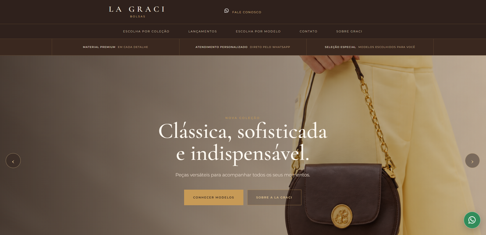
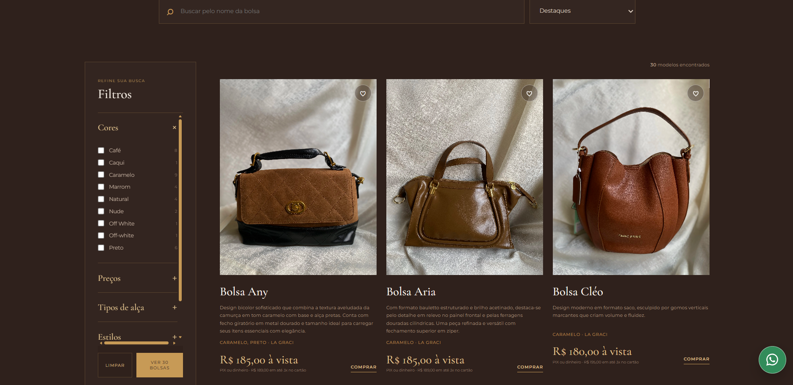
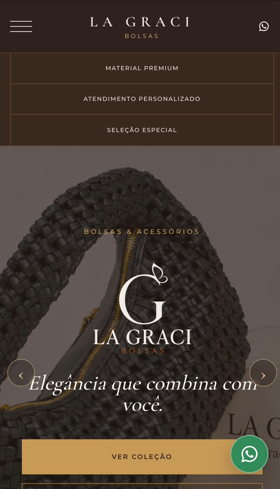
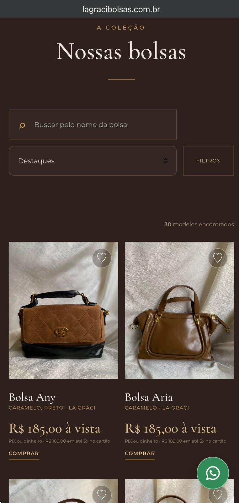

# La Graci Bolsas

Catálogo digital desenvolvido para apresentar os produtos da La Graci Bolsas e facilitar o contato entre clientes e loja. A interface reúne imagens, descrições e condições de pagamento em uma navegação adaptada ao computador e ao celular.

**[Visitar o site](https://lagracibolsas.com.br/)**

## Prévia do projeto

### Computador

**Página inicial**



**Catálogo e filtros**



### Celular

<p>
  
  
</p>

## Objetivo

Organizar a apresentação das bolsas em um catálogo que permita encontrar produtos, consultar detalhes e iniciar uma conversa com a loja pelo WhatsApp. O projeto também inclui um painel para administrar produtos e imagens.

## Funcionalidades

- Busca de bolsas pelo nome.
- Filtros por cor e faixa de preço, com opção de limpar a seleção.
- Ordenação dos produtos.
- Visualização de detalhes, imagens, descrição e condições de pagamento.
- Contato pelo WhatsApp com mensagem referente ao produto escolhido.
- Layout responsivo e painel de filtros para celular.
- Painel administrativo com autenticação pelo Supabase.
- Cadastro, edição e exclusão de produtos no painel.
- Envio de imagens para o Supabase Storage.

O atendimento e a negociação são realizados pelo WhatsApp. O site funciona como catálogo, sem checkout de pagamento integrado.

## Tecnologias

| Tecnologia | Utilização |
| --- | --- |
| HTML | Estrutura das páginas do catálogo e do painel |
| CSS | Identidade visual, componentes e adaptação a diferentes telas |
| JavaScript | Busca, filtros, ordenação, detalhes dos produtos e operações do painel |
| Supabase Database | Armazenamento dos dados dos produtos |
| Supabase Auth | Autenticação do painel administrativo |
| Supabase Storage | Armazenamento das imagens enviadas pelo painel |
| Netlify | Hospedagem do site |

## Estrutura do projeto

| Caminho | Conteúdo |
| --- | --- |
| `index.html` | Página pública do catálogo |
| `css/` | Estilos do catálogo |
| `js/catalog.js` | Dados iniciais e lógica do catálogo |
| `js/supabase-config.js` | Configuração da conexão com o Supabase |
| `admin/` | Página, estilos e lógica do painel administrativo |
| `assets/` | Imagens de produtos e elementos da identidade visual |

## Executar localmente

1. Clone este repositório:

   ```bash
   git clone https://github.com/jalkhalifa/catalogo-la-graci-bolsas.git
   cd catalogo-la-graci-bolsas
   ```

2. Inicie um servidor estático na raiz do projeto. Com Python instalado:

   ```bash
   python -m http.server 8000
   ```

   Também é possível utilizar a extensão Live Server do VS Code.

3. Abra `http://localhost:8000` para acessar o catálogo.
4. O painel administrativo está em `http://localhost:8000/admin/` e exige uma conta autorizada no Supabase.

Não há etapa de compilação nem instalação de dependências com npm. A biblioteca do Supabase é carregada por CDN.

## Configuração do Supabase

Para utilizar uma instância própria, configure a URL do projeto e a chave pública em `js/supabase-config.js`. O funcionamento completo também exige a tabela `produtos`, o bucket `produtos` no Storage e as políticas de acesso correspondentes.

Este repositório não contém um script de provisionamento do banco. Alterar apenas a URL e a chave não cria a estrutura necessária.

A chave pública do cliente pode estar no frontend. Chaves privadas, como `service_role`, e senhas de usuários não devem ser incluídas no código. As permissões de leitura e escrita devem ser controladas pelas políticas do Supabase.

## Decisões de interface

- Produtos apresentados com imagens e informações de preço próximas entre si.
- Filtros para reduzir a quantidade de itens exibidos e facilitar a escolha.
- Contato vinculado ao produto para contextualizar o atendimento.
- Paleta de tons terrosos e tipografia alinhadas à apresentação da marca.

## Autoria

Desenvolvido por **Jamila Khalifa**.

[Portfólio](https://portfolio-jamila-khalifa.netlify.app/) · [GitHub](https://github.com/jalkhalifa)

As imagens e a identidade da La Graci Bolsas pertencem aos seus respectivos titulares.

